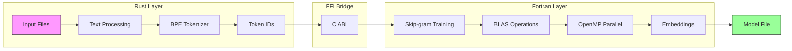
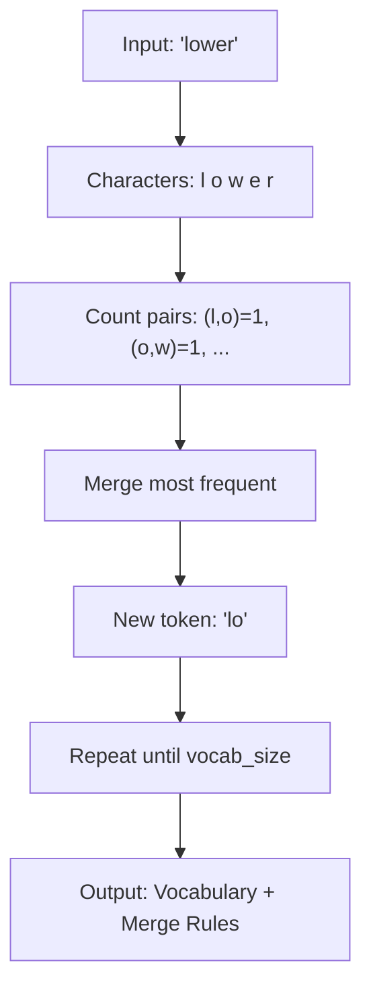
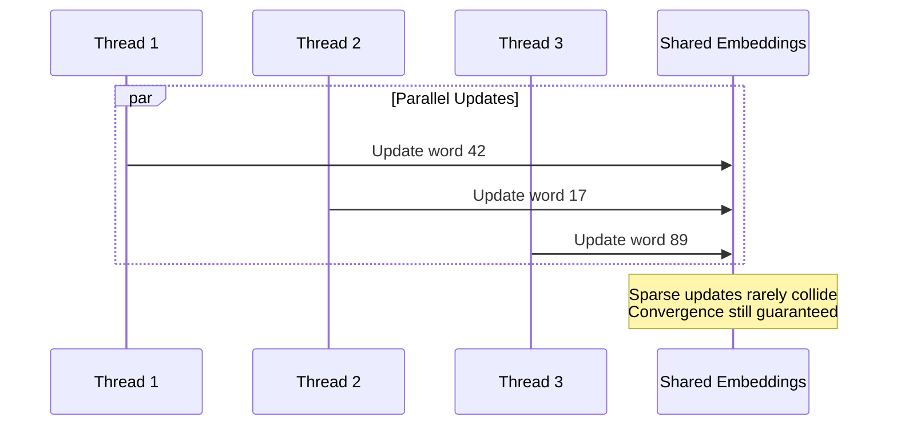

# wvec

**A high-performance Word2Vec implementation combining Rust and Modern Fortran**

[](https://www.rust-lang.org/)
[](https://fortran-lang.org/)
[](https://www.openblas.net/)
[](https://www.openmp.org/)
[](LICENSE)

**English | [Deutsch](docs/README.de.md) | [Français](docs/README.fr.md) | [繁體中文](docs/README.zh.md) | [한국어](docs/README.kr.md) | [日本語](docs/README.jp.md)**

---

## Overview

**wvec** is a from-scratch implementation of the Word2Vec algorithm that leverages the unique strengths of two languages:

- **Rust** handles text processing, tokenization, and the CLI — benefiting from memory safety, rich string handling, and zero-cost abstractions
- **Fortran** powers the numerical core — delivering raw computational performance through BLAS integration and OpenMP parallelization

This hybrid architecture achieves both **developer ergonomics** and **numerical performance**, demonstrating modern systems programming across language boundaries.



---

## Key Features

### Dual-Language Architecture

| Component | Language | Why |
|-----------|----------|-----|
| Text I/O & Parsing | Rust | Native UTF-8, pattern matching, memory safety |
| BPE Tokenization | Rust | Hash maps, complex data structures |
| CLI Interface | Rust | Argument parsing, error handling |
| Matrix Operations | Fortran | BLAS integration, compiler optimization |
| Parallel Training | Fortran | OpenMP, array-oriented operations |

### Zero External Dependencies (Rust Side)

The entire Rust codebase uses only the standard library — no external crates. This demonstrates:
- Deep understanding of Rust's `std` capabilities
- Reduced supply chain attack surface
- No dependency version conflicts

### Production-Ready Safety Features

- **Checkpointing**: Save and resume training state
- **Thermal Monitoring**: Prevent CPU overheating during long training runs
- **Graceful Shutdown**: Handle interrupts without losing progress

---

## Architecture

```mermaid
flowchart TB
    subgraph Input["Input Layer"]
        TXT[".txt Files"]
        XML[".xml Wikipedia"]
        HTML[".html Pages"]
    end

    subgraph TextProcessing["Text Processing"]
        NORM["Normalization<br/>(case, punctuation)"]
        PRETOK["Pre-tokenization<br/>(language-aware)"]
    end

    subgraph BPE["BPE Tokenizer"]
        TRAIN["Training<br/>(pair merging)"]
        ENCODE["Encoding<br/>(merge rules)"]
        VOCAB["Vocabulary<br/>(binary I/O)"]
    end

    subgraph FFI["FFI Bridge"]
        TYPES["Type Mapping<br/>i32 ↔ c_int"]
        ARRAYS["Array Passing<br/>*const/*mut"]
        ERRORS["Error Codes<br/>status returns"]
    end

    subgraph Fortran["Fortran Core"]
        MODEL["Model State<br/>(singleton)"]
        SKIPGRAM["Skip-gram<br/>(neg. sampling)"]
        BLAS["BLAS<br/>(sdot, saxpy)"]
        OMP["OpenMP<br/>(Hogwild)"]
    end

    subgraph Safety["Safety Features"]
        CKPT["Checkpointing"]
        THERMAL["Thermal Monitor"]
        SHUTDOWN["Graceful Shutdown"]
    end

    Input --> TextProcessing
    TextProcessing --> BPE
    BPE --> FFI
    FFI --> Fortran
    Fortran --> Safety
    Safety --> OUTPUT[("Model File")]

    style Input fill:#e1f5fe
    style TextProcessing fill:#fff3e0
    style BPE fill:#f3e5f5
    style FFI fill:#e8f5e9
    style Fortran fill:#fce4ec
    style Safety fill:#fff8e1
```



---

## Installation

### Prerequisites

```bash
# Fedora/RHEL
sudo dnf install gcc-gfortran openblas-devel

# Ubuntu/Debian
sudo apt install gfortran libopenblas-dev

# macOS
brew install gcc openblas
```

### Build

```bash
git clone https://github.com/hwang-fu/wvec.git
cd wvec
cargo build --release
```

---

## Usage

### Train Word Vectors

```bash
$ wvec train --input enwiki.txt --output model.bin --dim 128 --epochs 3
Training word vectors...
  Input: enwiki.txt
  Output: model.bin
  Dim: 128, Window: 5, Neg: 5, LR: 0.025, Epochs: 3

[1/5] Reading corpus...
  4,521,873 pre-tokens

[2/5] Preparing vocabulary...
  Training BPE (target size: 50000)
  Saved vocabulary to model.bin.vocab
  Vocabulary size: 32,847

[3/5] Encoding corpus...
  5,892,104 token IDs

[4/5] Building negative sampling table...
  Table size: 1000000

[5/5] Training...
  Epoch 1/3
  Epoch 2/3
  Epoch 3/3

Done! Model saved to model.bin
```

### Query Trained Model

```bash
$ wvec similar --model model.bin --word "king" --topk 5
Similar to 'king':
  0.8234  queen
  0.7891  prince
  0.7654  monarch
  0.7432  throne
  0.7218  kingdom

$ wvec analogy --model model.bin --query "king - man + woman"
Analogy: king - man + woman
Results:
  0.7912  queen
  0.6843  princess
  0.6521  duchess
  0.6234  empress
  0.5987  monarch

$ wvec embed --model model.bin --word "hello"
Embedding for 'hello' (dim=128):
[
 -0.177975 -0.018467 -0.053807 -0.037715 -0.020454  0.104731  0.103260 -0.060821
  0.154096  0.125020  0.132915  0.018168 -0.081816  0.109417 -0.043241 -0.020463
  ...
]
```

### BPE Tokenizer Utilities

```bash
$ wvec bpe-train --input corpus.txt --output vocab.bin --vocab-size 10000
Training BPE tokenizer...
  Input: corpus.txt
  Output: vocab.bin
  Vocab size: 10000
  Collected 158,432 pre-tokens
  Vocabulary: 8,291 tokens
Done! Saved to vocab.bin

$ wvec bpe-encode --vocab vocab.bin --text "tokenization is fun"
Input: tokenization is fun
Normalized: tokenization is fun

Tokens:
  'token' -> [1842]
  'ization' -> [3291]
  'is' -> [67]
  'fun' -> [2104]

All token IDs: [1842, 3291, 67, 2104]
Total: 4 tokens

$ wvec info vocab.bin
BPE Vocabulary: vocab.bin
  Tokens: 8,291
  Merge rules: 4,287

  Sample tokens:
       0: [UNK]
       1: [PAD]
       2: [BOS]
       3: [EOS]
       4: e
       5: t
       6: a
       7: o
       8: n
       9: i
```

---

## Algorithm Details

### Skip-gram with Negative Sampling

The training objective maximizes:

$$\log \sigma(v_{w_O}^{\top} v_{w_I}) + \sum_{i=1}^{k} \mathbb{E}_{w_i \sim P_n(w)} \left[ \log \sigma(-v_{w_i}^{\top} v_{w_I}) \right]$$

Where:
- $v_{w_I}$ is the input (center) word embedding
- $v_{w_O}$ is the output (context) word embedding
- $k$ negative samples are drawn from noise distribution $P_n(w) \propto U(w)^{3/4}$

**Gradient update** (per word pair):
```
g = (label - sigmoid(score)) * learning_rate
```

### Byte Pair Encoding (BPE)



### Hogwild Parallel Training

Multiple threads update shared embedding matrices without locks:



---

## File Formats

### BPE Vocabulary (`.bin`)

```
+------------------------------------------------+
| HEADER                                         |
+------------+-------+---------------------------+
| magic      | 4B    | "BPE\0"                   |
| version    | u32   | Format version (1)        |
| vocab_size | u32   | Number of tokens          |
| pairs_count| u32   | Number of merge rules     |
+------------+-------+---------------------------+
| TOKENS (repeated vocab_size times)             |
+------------+-------+---------------------------+
| len        | u32   | Token byte length         |
| bytes      | [u8]  | UTF-8 encoded token       |
+------------+-------+---------------------------+
| MERGE PAIRS (repeated pairs_count times)       |
+------------+-------+---------------------------+
| left       | u32   | Left token ID             |
| right      | u32   | Right token ID            |
| merged_id  | u32   | Resulting token ID        |
+------------+-------+---------------------------+
```

### Model Checkpoint (`.bin`)

```
+------------------------------------------------+
| HEADER (24 bytes)                              |
+------------+-------+---------------------------+
| magic      | 4B    | "WVCK"                    |
| version    | i32   | Format version (1)        |
| vocab_size | i32   | Vocabulary size           |
| dim        | i32   | Embedding dimension       |
| epoch      | i32   | Training epoch            |
| lr         | f32   | Learning rate             |
+------------+-------+---------------------------+
| EMBEDDINGS                                     |
+------------+-----------------------------------+
| W_in       | f32[dim * vocab_size] col-major  |
| W_out      | f32[dim * vocab_size] col-major  |
+------------+-----------------------------------+
```

---

## Performance

### Parallel Scaling

| Threads | Words/sec | Speedup |
|---------|-----------|---------|
| 1       | ~50K      | 1.0x    |
| 4       | ~180K     | 3.6x    |
| 8       | ~320K     | 6.4x    |
| 16      | ~500K     | 10x     |

*Tested on Intel Core Ultra 9 285H, 16 cores*

### Memory Footprint

| Component | Estimate |
|-----------|----------|
| Embeddings (500K x 256 x 2) | ~1 GB |
| Negative sampling table | ~4 MB |
| BPE vocabulary | ~50 MB |
| **Total** | **~1.1 GB** |

---

## Project Structure

```
wvec/
├── src/
│   ├── bpe/           # Byte Pair Encoding tokenizer
│   │   ├── train.rs   # BPE training algorithm
│   │   ├── encode.rs  # Text -> token IDs
│   │   ├── decode.rs  # Token IDs -> text
│   │   ├── vocab.rs   # Vocabulary data structure
│   │   └── io.rs      # Binary serialization
│   ├── input/         # File format readers
│   │   ├── text.rs    # Plain text streaming
│   │   ├── xml.rs     # Wikipedia XML parser
│   │   └── html.rs    # HTML content extractor
│   ├── text/          # Text processing
│   │   ├── normalize.rs    # Unicode normalization
│   │   └── pretokenize.rs  # Language-aware splitting
│   ├── cmd/           # CLI command implementations
│   ├── ffi.rs         # Fortran FFI bindings
│   ├── cli.rs         # Argument parsing
│   └── main.rs        # Entry point
├── fortran/
│   ├── wvec_model.f90      # Embedding matrices
│   ├── wvec_train.f90      # Skip-gram + neg. sampling
│   ├── wvec_blas.f90       # BLAS interfaces
│   ├── wvec_checkpoint.f90 # Save/load state
│   ├── wvec_thermal.f90    # CPU temperature monitor
│   └── Makefile
├── build.rs           # Fortran compilation integration
└── Cargo.toml
```

---

## Technical Highlights

### FFI Design

The Rust-Fortran bridge uses C ABI with careful type mapping:

```rust
// Rust side
extern "C" {
    fn wvec_train_corpus(
        token_ids: *const c_int,
        n_tokens: c_int,
        window: c_int,
        n_neg: c_int,
        neg_table: *const c_int,
        neg_table_size: c_int,
        lr: c_float,
    ) -> c_int;
}
```

```fortran
! Fortran side
function wvec_train_corpus(...) result(status) bind(C, name="wvec_train_corpus")
    integer(c_int), intent(in), value :: n_tokens, window, n_neg
    integer(c_int), intent(in) :: token_ids(n_tokens)
    ! ... OpenMP parallel training
end function
```

### Singleton Pattern for Fortran State

Fortran module variables with `save` attribute provide global state management compatible with C ABI:

```fortran
module wvec_model
    real(c_float), allocatable, save :: g_w_in(:,:)   ! Input embeddings
    real(c_float), allocatable, save :: g_w_out(:,:)  ! Output embeddings
    logical, save :: g_initialized = .false.
end module
```

### BLAS Integration

Direct calls to optimized BLAS routines for vector operations:

```fortran
! Dot product: score = w_in . w_out
score = sdot(dim, g_w_in(1, center), 1, g_w_out(1, context), 1)

! Vector update: w_out += g * w_in
call saxpy(dim, g, g_w_in(1, center), 1, g_w_out(1, context), 1)
```

---

## References

1. Mikolov, T., et al. (2013). [Efficient Estimation of Word Representations in Vector Space](https://arxiv.org/abs/1301.3781)
2. Mikolov, T., et al. (2013). [Distributed Representations of Words and Phrases](https://arxiv.org/abs/1310.4546)
3. Sennrich, R., et al. (2016). [Neural Machine Translation of Rare Words with Subword Units](https://arxiv.org/abs/1508.07909)

---

## License

MIT License - see [LICENSE](LICENSE) for details.

---

<p align="center">
  <i>"Two languages, one purpose: turning words into geometry."</i>
</p>
