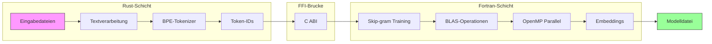
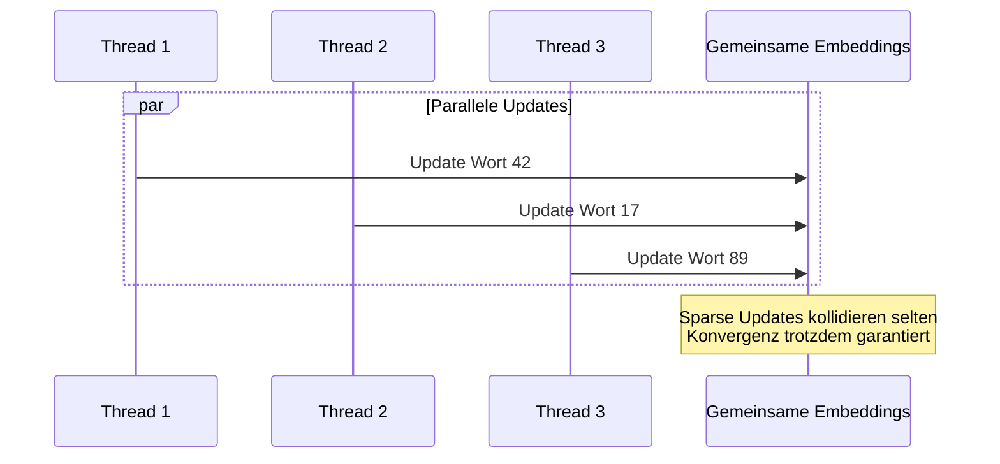

# wvec

**Eine hochperformante Word2Vec-Implementierung in Rust und modernem Fortran**

[](https://www.rust-lang.org/)
[](https://fortran-lang.org/)
[](https://www.openblas.net/)
[](https://www.openmp.org/)
[](LICENSE)

**[English](../README.md) | Deutsch | [Francais](README.fr.md) | [繁體中文](README.zh.md) | [한국어](README.kr.md) | [日本語](README.jp.md)**

---

## Uberblick

**wvec** ist eine von Grund auf neu entwickelte Implementierung des Word2Vec-Algorithmus, die die einzigartigen Starken zweier Sprachen nutzt:

- **Rust** ubernimmt Textverarbeitung, Tokenisierung und CLI — profitiert von Speichersicherheit, leistungsfahiger String-Verarbeitung und Zero-Cost-Abstraktionen
- **Fortran** treibt den numerischen Kern an — liefert rohe Rechenleistung durch BLAS-Integration und OpenMP-Parallelisierung

Diese hybride Architektur erreicht sowohl **Entwicklerergonomie** als auch **numerische Performance** und demonstriert moderne Systemprogrammierung uber Sprachgrenzen hinweg.



---

## Hauptmerkmale

### Zweisprachige Architektur

| Komponente | Sprache | Warum |
|------------|---------|-------|
| Text-I/O & Parsing | Rust | Native UTF-8, Pattern Matching, Speichersicherheit |
| BPE-Tokenisierung | Rust | Hash Maps, komplexe Datenstrukturen |
| CLI-Schnittstelle | Rust | Argument-Parsing, Fehlerbehandlung |
| Matrix-Operationen | Fortran | BLAS-Integration, Compiler-Optimierung |
| Paralleles Training | Fortran | OpenMP, Array-orientierte Operationen |

### Keine externen Abhangigkeiten (Rust-Seite)

Die gesamte Rust-Codebasis verwendet nur die Standardbibliothek — keine externen Crates. Das demonstriert:
- Tiefes Verstandnis der `std`-Fahigkeiten von Rust
- Reduzierte Supply-Chain-Angriffsflache
- Keine Abhangigkeits-Versionskonflikte

### Produktionsreife Sicherheitsfunktionen

- **Checkpointing**: Trainingszustand speichern und fortsetzen
- **Thermal Monitoring**: CPU-Uberhitzung bei langen Trainings verhindern
- **Graceful Shutdown**: Interrupts behandeln ohne Fortschritt zu verlieren

---

## Installation

### Voraussetzungen

```bash
# Fedora/RHEL
sudo dnf install gcc-gfortran openblas-devel

# Ubuntu/Debian
sudo apt install gfortran libopenblas-dev

# macOS
brew install gcc openblas
```

### Build

```bash
git clone https://github.com/hwang-fu/wvec.git
cd wvec
cargo build --release
```

### Testen

```bash
# Alle Tests ausfuhren (Single-Thread-Modus erforderlich)
$ cargo test -- --test-threads=1

running 162 tests
...
test result: ok. 162 passed; 0 failed; 0 ignored

# Build-Artefakte aufraumen
$ cargo clean
$ make -C fortran clean
```

> **Warum `--test-threads=1`?**
>
> Der numerische Fortran-Kern verwendet ein **Singleton-Pattern** fur Embedding-Matrizen (`g_w_in`, `g_w_out`).
> Dieses Design ermoglicht effiziente OpenMP-Parallelisierung innerhalb einer Trainingssitzung, bedeutet aber,
> dass mehrere Rust-Tests nicht sicher gleichzeitig `wvec_model_init()` / `wvec_model_free()` aufrufen konnen.
>
> Single-Threaded-Tests verhindern Race Conditions auf dem gemeinsamen Fortran-Zustand.

---

## Verwendung

### Word-Vektoren trainieren

```bash
$ wvec train --input enwiki.txt --output model.bin --dim 128 --epochs 3
Training word vectors...
  Input: enwiki.txt
  Output: model.bin
  Dim: 128, Window: 5, Neg: 5, LR: 0.025, Epochs: 3

[1/5] Reading corpus...
  4,521,873 pre-tokens

[2/5] Preparing vocabulary...
  Training BPE (target size: 50000)
  Saved vocabulary to model.bin.vocab
  Vocabulary size: 32,847

[3/5] Encoding corpus...
  5,892,104 token IDs

[4/5] Building negative sampling table...
  Table size: 1000000

[5/5] Training...
  Epoch 1/3
  Epoch 2/3
  Epoch 3/3

Done! Model saved to model.bin
```

### Trainiertes Modell abfragen

```bash
$ wvec similar --model model.bin --word "konig" --topk 5
Similar to 'konig':
  0.8234  konigin
  0.7891  prinz
  0.7654  monarch
  0.7432  thron
  0.7218  konigreich

$ wvec analogy --model model.bin --query "konig - mann + frau"
Analogy: konig - mann + frau
Results:
  0.7912  konigin
  0.6843  prinzessin
  0.6521  herzogin
  0.6234  kaiserin
  0.5987  monarch
```

### BPE-Tokenizer-Werkzeuge

```bash
$ wvec bpe-train --input corpus.txt --output vocab.bin --vocab-size 10000
Training BPE tokenizer...
  Input: corpus.txt
  Output: vocab.bin
  Vocab size: 10000
  Collected 158,432 pre-tokens
  Vocabulary: 8,291 tokens
Done! Saved to vocab.bin

$ wvec info vocab.bin
BPE Vocabulary: vocab.bin
  Tokens: 8,291
  Merge rules: 4,287
```

---

## Algorithmus-Details

### Skip-gram mit Negative Sampling

Das Trainingsziel maximiert:

$$\log \sigma(v_{w_O}^{\top} v_{w_I}) + \sum_{i=1}^{k} \mathbb{E}_{w_i \sim P_n(w)} \left[ \log \sigma(-v_{w_i}^{\top} v_{w_I}) \right]$$

Wobei:
- $v_{w_I}$ das Input-(Center-)Wort-Embedding ist
- $v_{w_O}$ das Output-(Context-)Wort-Embedding ist
- $k$ negative Samples aus der Rauschverteilung $P_n(w) \propto U(w)^{3/4}$ gezogen werden

### Hogwild Paralleles Training

Mehrere Threads aktualisieren gemeinsame Embedding-Matrizen ohne Locks:



---

## Performance

### Parallele Skalierung

| Threads | Worter/Sek | Speedup |
|---------|------------|---------|
| 1       | ~50K       | 1.0x    |
| 4       | ~180K      | 3.6x    |
| 8       | ~320K      | 6.4x    |
| 16      | ~500K      | 10x     |

*Getestet auf Intel Core Ultra 9 285H, 16 Kerne*

---

## Lizenz

MIT-Lizenz - siehe [LICENSE](../LICENSE) fur Details.

---

<p align="center">
  <i>"Zwei Sprachen, ein Ziel: Worter in Geometrie verwandeln."</i>
</p>
