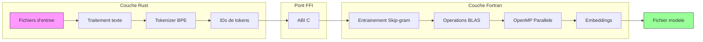
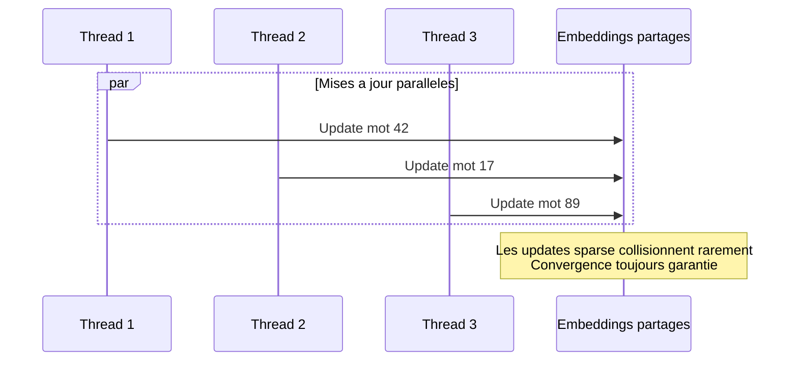

# wvec

**Une implementation haute performance de Word2Vec combinant Rust et Fortran moderne**

[](https://www.rust-lang.org/)
[](https://fortran-lang.org/)
[](https://www.openblas.net/)
[](https://www.openmp.org/)
[](LICENSE)

**[English](../README.md) | [Deutsch](README.de.md) | Francais | [繁體中文](README.zh.md) | [한국어](README.kr.md) | [日本語](README.jp.md)**

---

## Apercu

**wvec** est une implementation de l'algorithme Word2Vec developpee de zero qui exploite les forces uniques de deux langages :

- **Rust** gere le traitement de texte, la tokenisation et le CLI — beneficiant de la securite memoire, de la manipulation de chaines performante et des abstractions zero-cout
- **Fortran** alimente le coeur numerique — delivrant une performance de calcul brute grace a l'integration BLAS et la parallelisation OpenMP

Cette architecture hybride atteint a la fois l'**ergonomie developpeur** et la **performance numerique**, demonstrant la programmation systeme moderne a travers les frontieres des langages.



---

## Caracteristiques principales

### Architecture bi-langage

| Composant | Langage | Pourquoi |
|-----------|---------|----------|
| I/O texte & Parsing | Rust | UTF-8 natif, pattern matching, securite memoire |
| Tokenisation BPE | Rust | Hash maps, structures de donnees complexes |
| Interface CLI | Rust | Parsing d'arguments, gestion d'erreurs |
| Operations matricielles | Fortran | Integration BLAS, optimisation compilateur |
| Entrainement parallele | Fortran | OpenMP, operations orientees tableaux |

### Zero dependances externes (cote Rust)

L'ensemble du code Rust utilise uniquement la bibliotheque standard — aucun crate externe. Cela demontre :
- Comprehension profonde des capacites de `std` de Rust
- Surface d'attaque supply chain reduite
- Aucun conflit de versions de dependances

### Fonctionnalites de securite production-ready

- **Checkpointing** : Sauvegarder et reprendre l'etat d'entrainement
- **Monitoring thermique** : Prevenir la surchauffe CPU lors d'entrainements longs
- **Arret gracieux** : Gerer les interruptions sans perdre la progression

---

## Installation

### Prerequis

```bash
# Fedora/RHEL
sudo dnf install gcc-gfortran openblas-devel

# Ubuntu/Debian
sudo apt install gfortran libopenblas-dev

# macOS
brew install gcc openblas
```

### Build

```bash
git clone https://github.com/hwang-fu/wvec.git
cd wvec
cargo build --release
```

### Tests

```bash
# Executer tous les tests (mode single-thread requis)
$ cargo test -- --test-threads=1

running 162 tests
...
test result: ok. 162 passed; 0 failed; 0 ignored

# Nettoyer les artefacts de build
$ cargo clean
$ make -C fortran clean
```

> **Pourquoi `--test-threads=1` ?**
>
> Le coeur numerique Fortran utilise un **pattern singleton** pour les matrices d'embeddings (`g_w_in`, `g_w_out`).
> Cette conception permet une parallelisation OpenMP efficace au sein d'une session d'entrainement, mais signifie
> que plusieurs tests Rust ne peuvent pas appeler `wvec_model_init()` / `wvec_model_free()` simultanement en securite.
>
> Executer les tests en single-thread evite les conditions de course sur l'etat Fortran partage.

---

## Utilisation

### Entrainer des vecteurs de mots

```bash
$ wvec train --input frwiki.txt --output model.bin --dim 128 --epochs 3
Training word vectors...
  Input: frwiki.txt
  Output: model.bin
  Dim: 128, Window: 5, Neg: 5, LR: 0.025, Epochs: 3

[1/5] Reading corpus...
  4,521,873 pre-tokens

[2/5] Preparing vocabulary...
  Training BPE (target size: 50000)
  Vocabulary size: 32,847

[3/5] Encoding corpus...
  5,892,104 token IDs

[4/5] Building negative sampling table...
  Table size: 1000000

[5/5] Training...
  Epoch 1/3
  Epoch 2/3
  Epoch 3/3

Done! Model saved to model.bin
```

### Interroger le modele entraine

```bash
$ wvec similar --model model.bin --word "roi" --topk 5
Similar to 'roi':
  0.8234  reine
  0.7891  prince
  0.7654  monarque
  0.7432  trone
  0.7218  royaume

$ wvec analogy --model model.bin --query "roi - homme + femme"
Analogy: roi - homme + femme
Results:
  0.7912  reine
  0.6843  princesse
  0.6521  duchesse
  0.6234  imperatrice
  0.5987  monarque
```

---

## Details des algorithmes

### Skip-gram avec echantillonnage negatif

L'objectif d'entrainement maximise :

$$\log \sigma(v_{w_O}^{\top} v_{w_I}) + \sum_{i=1}^{k} \mathbb{E}_{w_i \sim P_n(w)} \left[ \log \sigma(-v_{w_i}^{\top} v_{w_I}) \right]$$

Ou :
- $v_{w_I}$ est l'embedding du mot d'entree (centre)
- $v_{w_O}$ est l'embedding du mot de sortie (contexte)
- $k$ echantillons negatifs sont tires de la distribution de bruit $P_n(w) \propto U(w)^{3/4}$

### Entrainement parallele Hogwild

Plusieurs threads mettent a jour les matrices d'embeddings partagees sans verrous :



---

## Performance

### Mise a l'echelle parallele

| Threads | Mots/sec | Acceleration |
|---------|----------|--------------|
| 1       | ~50K     | 1.0x         |
| 4       | ~180K    | 3.6x         |
| 8       | ~320K    | 6.4x         |
| 16      | ~500K    | 10x          |

*Teste sur Intel Core Ultra 9 285H, 16 coeurs*

---

## Licence

Licence MIT - voir [LICENSE](../LICENSE) pour les details.

---

<p align="center">
  <i>"Deux langages, un objectif : transformer les mots en geometrie."</i>
</p>
