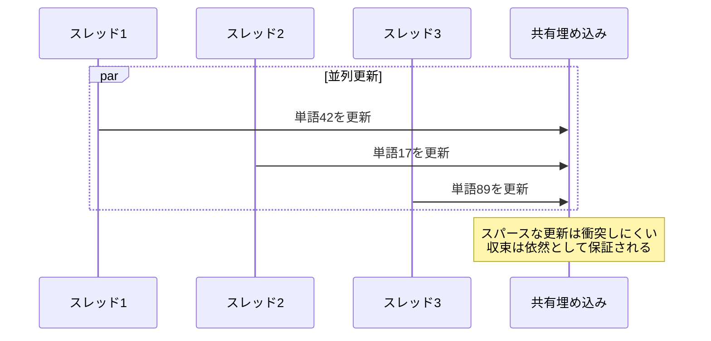

# wvec

**RustとモダンFortranを組み合わせた高性能Word2Vec実装**

[](https://www.rust-lang.org/)
[](https://fortran-lang.org/)
[](https://www.openblas.net/)
[](https://www.openmp.org/)
[](LICENSE)

**[English](../README.md) | [Deutsch](README.de.md) | [Français](README.fr.md) | [繁體中文](README.zh.md) | [한국어](README.kr.md) | 日本語**

---

## 概要

**wvec**は、2つの言語のユニークな強みを活かしてゼロから実装したWord2Vecアルゴリズムです：

- **Rust**がテキスト処理、トークン化、CLIを担当 — メモリ安全性、強力な文字列処理、ゼロコスト抽象化の恩恵
- **Fortran**が数値計算コアを駆動 — BLAS統合とOpenMP並列化による生の計算性能を提供

このハイブリッドアーキテクチャは**開発者の使いやすさ**と**数値性能**の両方を実現し、言語の境界を越えた現代的なシステムプログラミングを示しています。


---

## 主な特徴

### デュアル言語アーキテクチャ

| コンポーネント | 言語 | 理由 |
|----------------|------|------|
| テキストI/O & パース | Rust | ネイティブUTF-8、パターンマッチング、メモリ安全性 |
| BPEトークン化 | Rust | ハッシュマップ、複雑なデータ構造 |
| CLIインターフェース | Rust | 引数パース、エラー処理 |
| 行列演算 | Fortran | BLAS統合、コンパイラ最適化 |
| 並列訓練 | Fortran | OpenMP、配列指向演算 |

### 外部依存ゼロ（Rust側）

Rustコードベース全体が標準ライブラリのみを使用 — 外部クレートなし。これは以下を示しています：
- Rustの`std`機能への深い理解
- サプライチェーン攻撃面の削減
- 依存関係バージョンの競合なし

### プロダクションレディな安全機能

- **チェックポイント**：訓練状態の保存と再開
- **温度監視**：長時間訓練時のCPU過熱防止
- **グレースフルシャットダウン**：進捗を失わずに割り込みを処理

---

## インストール

### 前提条件

```bash
# Fedora/RHEL
sudo dnf install gcc-gfortran openblas-devel

# Ubuntu/Debian
sudo apt install gfortran libopenblas-dev

# macOS
brew install gcc openblas
```

### ビルド

```bash
git clone https://github.com/hwang-fu/wvec.git
cd wvec
cargo build --release
```

### テスト

```bash
# 全テストを実行（シングルスレッドモード必須）
$ cargo test -- --test-threads=1

running 162 tests
...
test result: ok. 162 passed; 0 failed; 0 ignored

# ビルド成果物をクリーンアップ
$ cargo clean
$ make -C fortran clean
```

> **なぜ `--test-threads=1` が必要？**
>
> Fortran数値計算コアは埋め込み行列（`g_w_in`、`g_w_out`）に**シングルトンパターン**を使用しています。
> この設計により単一の訓練セッション内で効率的なOpenMP並列化が可能になりますが、
> 複数のRustテストが同時に `wvec_model_init()` / `wvec_model_free()` を安全に呼び出すことはできません。
>
> シングルスレッドテストは共有Fortran状態でのレースコンディションを防止します。

---

## 使用方法

### 単語ベクトルの訓練

```bash
$ wvec train --input jawiki.txt --output model.bin --dim 128 --epochs 3
Training word vectors...
  Input: jawiki.txt
  Output: model.bin
  Dim: 128, Window: 5, Neg: 5, LR: 0.025, Epochs: 3

[1/5] Reading corpus...
  4,521,873 pre-tokens

[2/5] Preparing vocabulary...
  Training BPE (target size: 50000)
  Vocabulary size: 32,847

[3/5] Encoding corpus...
  5,892,104 token IDs

[4/5] Building negative sampling table...
  Table size: 1000000

[5/5] Training...
  Epoch 1/3
  Epoch 2/3
  Epoch 3/3

Done! Model saved to model.bin
```

### 訓練済みモデルのクエリ

```bash
$ wvec similar --model model.bin --word "王" --topk 5
Similar to '王':
  0.8234  女王
  0.7891  王子
  0.7654  君主
  0.7432  王座
  0.7218  王国

$ wvec analogy --model model.bin --query "王 - 男 + 女"
Analogy: 王 - 男 + 女
Results:
  0.7912  女王
  0.6843  王女
  0.6521  公爵夫人
  0.6234  皇后
  0.5987  君主
```

---

## アルゴリズムの詳細

### ネガティブサンプリング付きSkip-gram

訓練目標は以下を最大化します：

$$\log \sigma(v_{w_O}^{\top} v_{w_I}) + \sum_{i=1}^{k} \mathbb{E}_{w_i \sim P_n(w)} \left[ \log \sigma(-v_{w_i}^{\top} v_{w_I}) \right]$$

ここで：
- $v_{w_I}$は入力（中心）単語の埋め込み
- $v_{w_O}$は出力（コンテキスト）単語の埋め込み
- $k$個のネガティブサンプルがノイズ分布$P_n(w) \propto U(w)^{3/4}$から抽出される

### Hogwild並列訓練

複数のスレッドがロックなしで共有埋め込み行列を更新します：



---

## パフォーマンス

### 並列スケーリング

| スレッド | 単語/秒 | 高速化 |
|----------|---------|--------|
| 1        | ~50K    | 1.0x   |
| 4        | ~180K   | 3.6x   |
| 8        | ~320K   | 6.4x   |
| 16       | ~500K   | 10x    |

*Intel Core Ultra 9 285H、16コアでテスト*

---

## ライセンス

MITライセンス - 詳細は[LICENSE](../LICENSE)を参照してください。

---

<p align="center">
  <i>「2つの言語、1つの目的：言葉を幾何学に変える。」</i>
</p>
