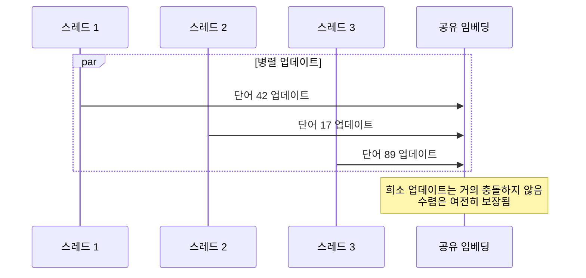

# wvec

**Rust와 Modern Fortran을 결합한 고성능 Word2Vec 구현**

[](https://www.rust-lang.org/)
[](https://fortran-lang.org/)
[](https://www.openblas.net/)
[](https://www.openmp.org/)
[](LICENSE)

**[English](../README.md) | [Deutsch](README.de.md) | [Français](README.fr.md) | [繁體中文](README.zh.md) | 한국어 | [日本語](README.jp.md)**

---

## 개요

**wvec**는 두 언어의 고유한 장점을 활용하여 처음부터 구현한 Word2Vec 알고리즘입니다:

- **Rust**는 텍스트 처리, 토큰화, CLI를 담당 — 메모리 안전성, 강력한 문자열 처리, 제로 코스트 추상화의 이점
- **Fortran**은 수치 연산 코어를 구동 — BLAS 통합과 OpenMP 병렬화를 통한 원시 연산 성능 제공

이 하이브리드 아키텍처는 **개발자 편의성**과 **수치 성능**을 모두 달성하며, 언어 경계를 넘나드는 현대적 시스템 프로그래밍을 보여줍니다.


---

## 주요 특징

### 이중 언어 아키텍처

| 컴포넌트 | 언어 | 이유 |
|----------|------|------|
| 텍스트 I/O & 파싱 | Rust | 네이티브 UTF-8, 패턴 매칭, 메모리 안전성 |
| BPE 토큰화 | Rust | 해시 맵, 복잡한 데이터 구조 |
| CLI 인터페이스 | Rust | 인자 파싱, 에러 처리 |
| 행렬 연산 | Fortran | BLAS 통합, 컴파일러 최적화 |
| 병렬 훈련 | Fortran | OpenMP, 배열 지향 연산 |

### 외부 의존성 제로 (Rust 측)

전체 Rust 코드베이스는 표준 라이브러리만 사용 — 외부 크레이트 없음. 이는 다음을 보여줍니다:
- Rust `std` 기능에 대한 깊은 이해
- 공급망 공격 표면 감소
- 의존성 버전 충돌 없음

### 프로덕션 레디 안전 기능

- **체크포인팅**: 훈련 상태 저장 및 재개
- **온도 모니터링**: 장시간 훈련 시 CPU 과열 방지
- **그레이스풀 셧다운**: 진행 상황 손실 없이 인터럽트 처리

---

## 설치

### 사전 요구사항

```bash
# Fedora/RHEL
sudo dnf install gcc-gfortran openblas-devel

# Ubuntu/Debian
sudo apt install gfortran libopenblas-dev

# macOS
brew install gcc openblas
```

### 빌드

```bash
git clone https://github.com/hwang-fu/wvec.git
cd wvec
cargo build --release
```

---

## 사용법

### 워드 벡터 훈련

```bash
$ wvec train --input kowiki.txt --output model.bin --dim 128 --epochs 3
Training word vectors...
  Input: kowiki.txt
  Output: model.bin
  Dim: 128, Window: 5, Neg: 5, LR: 0.025, Epochs: 3

[1/5] Reading corpus...
  4,521,873 pre-tokens

[2/5] Preparing vocabulary...
  Training BPE (target size: 50000)
  Vocabulary size: 32,847

[3/5] Encoding corpus...
  5,892,104 token IDs

[4/5] Building negative sampling table...
  Table size: 1000000

[5/5] Training...
  Epoch 1/3
  Epoch 2/3
  Epoch 3/3

Done! Model saved to model.bin
```

### 훈련된 모델 쿼리

```bash
$ wvec similar --model model.bin --word "왕" --topk 5
Similar to '왕':
  0.8234  왕비
  0.7891  왕자
  0.7654  군주
  0.7432  왕좌
  0.7218  왕국

$ wvec analogy --model model.bin --query "왕 - 남자 + 여자"
Analogy: 왕 - 남자 + 여자
Results:
  0.7912  왕비
  0.6843  공주
  0.6521  공작부인
  0.6234  황후
  0.5987  군주
```

---

## 알고리즘 상세

### 네거티브 샘플링을 사용한 Skip-gram

훈련 목표는 다음을 최대화합니다:

$$\log \sigma(v_{w_O}^{\top} v_{w_I}) + \sum_{i=1}^{k} \mathbb{E}_{w_i \sim P_n(w)} \left[ \log \sigma(-v_{w_i}^{\top} v_{w_I}) \right]$$

여기서:
- $v_{w_I}$는 입력(중심) 단어 임베딩
- $v_{w_O}$는 출력(문맥) 단어 임베딩
- $k$개의 네거티브 샘플은 노이즈 분포 $P_n(w) \propto U(w)^{3/4}$에서 추출

### Hogwild 병렬 훈련

여러 스레드가 락 없이 공유 임베딩 행렬을 업데이트합니다:



---

## 성능

### 병렬 스케일링

| 스레드 | 단어/초 | 속도 향상 |
|--------|---------|-----------|
| 1      | ~50K    | 1.0x      |
| 4      | ~180K   | 3.6x      |
| 8      | ~320K   | 6.4x      |
| 16     | ~500K   | 10x       |

*Intel Core Ultra 9 285H, 16코어에서 테스트*

---

## 라이선스

MIT 라이선스 - 자세한 내용은 [LICENSE](../LICENSE)를 참조하세요.

---

<p align="center">
  <i>"두 언어, 하나의 목적: 단어를 기하학으로 바꾸다."</i>
</p>
