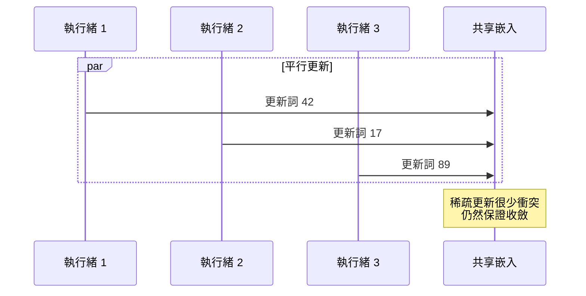

# wvec

**結合 Rust 與現代 Fortran 的高效能 Word2Vec 實作**

[](https://www.rust-lang.org/)
[](https://fortran-lang.org/)
[](https://www.openblas.net/)
[](https://www.openmp.org/)
[](LICENSE)

**[English](../README.md) | [Deutsch](README.de.md) | [Français](README.fr.md) | 繁體中文 | [한국어](README.kr.md) | [日本語](README.jp.md)**

---

## 概述

**wvec** 是一個從零開始實作的 Word2Vec 演算法，充分發揮兩種程式語言的獨特優勢：

- **Rust** 負責文字處理、分詞和命令列介面 — 受益於記憶體安全、強大的字串處理和零成本抽象
- **Fortran** 驅動數值運算核心 — 透過 BLAS 整合和 OpenMP 平行化提供原始運算效能

這種混合架構同時實現了**開發者友善性**與**數值效能**，展示了跨語言邊界的現代系統程式設計。


---

## 主要特色

### 雙語言架構

| 元件 | 語言 | 原因 |
|------|------|------|
| 文字 I/O 與解析 | Rust | 原生 UTF-8、模式匹配、記憶體安全 |
| BPE 分詞 | Rust | 雜湊表、複雜資料結構 |
| CLI 介面 | Rust | 參數解析、錯誤處理 |
| 矩陣運算 | Fortran | BLAS 整合、編譯器最佳化 |
| 平行訓練 | Fortran | OpenMP、陣列導向運算 |

### 零外部依賴（Rust 端）

整個 Rust 程式碼只使用標準函式庫 — 沒有任何外部 crate。這展示了：
- 對 Rust `std` 能力的深入理解
- 降低供應鏈攻擊風險
- 無依賴版本衝突

### 生產級安全功能

- **檢查點**：儲存並恢復訓練狀態
- **溫度監控**：防止長時間訓練時 CPU 過熱
- **優雅關閉**：處理中斷而不丟失進度

---

## 安裝

### 前置需求

```bash
# Fedora/RHEL
sudo dnf install gcc-gfortran openblas-devel

# Ubuntu/Debian
sudo apt install gfortran libopenblas-dev

# macOS
brew install gcc openblas
```

### 建置

```bash
git clone https://github.com/hwang-fu/wvec.git
cd wvec
cargo build --release
```

---

## 使用方式

### 訓練詞向量

```bash
$ wvec train --input zhwiki.txt --output model.bin --dim 128 --epochs 3
Training word vectors...
  Input: zhwiki.txt
  Output: model.bin
  Dim: 128, Window: 5, Neg: 5, LR: 0.025, Epochs: 3

[1/5] Reading corpus...
  4,521,873 pre-tokens

[2/5] Preparing vocabulary...
  Training BPE (target size: 50000)
  Vocabulary size: 32,847

[3/5] Encoding corpus...
  5,892,104 token IDs

[4/5] Building negative sampling table...
  Table size: 1000000

[5/5] Training...
  Epoch 1/3
  Epoch 2/3
  Epoch 3/3

Done! Model saved to model.bin
```

### 查詢已訓練模型

```bash
$ wvec similar --model model.bin --word "國王" --topk 5
Similar to '國王':
  0.8234  王后
  0.7891  王子
  0.7654  君主
  0.7432  王位
  0.7218  王國

$ wvec analogy --model model.bin --query "國王 - 男人 + 女人"
Analogy: 國王 - 男人 + 女人
Results:
  0.7912  王后
  0.6843  公主
  0.6521  女公爵
  0.6234  皇后
  0.5987  君主
```

---

## 演算法細節

### 帶負採樣的 Skip-gram

訓練目標最大化：

$$\log \sigma(v_{w_O}^{\top} v_{w_I}) + \sum_{i=1}^{k} \mathbb{E}_{w_i \sim P_n(w)} \left[ \log \sigma(-v_{w_i}^{\top} v_{w_I}) \right]$$

其中：
- $v_{w_I}$ 是輸入（中心）詞的嵌入
- $v_{w_O}$ 是輸出（上下文）詞的嵌入
- $k$ 個負樣本從噪音分佈 $P_n(w) \propto U(w)^{3/4}$ 中抽取

### Hogwild 平行訓練

多個執行緒無鎖更新共享的嵌入矩陣：



---

## 效能

### 平行擴展性

| 執行緒 | 詞/秒 | 加速比 |
|--------|-------|--------|
| 1      | ~50K  | 1.0x   |
| 4      | ~180K | 3.6x   |
| 8      | ~320K | 6.4x   |
| 16     | ~500K | 10x    |

*測試環境：Intel Core Ultra 9 285H，16 核心*

---

## 授權

MIT 授權 - 詳見 [LICENSE](../LICENSE)。

---

<p align="center">
  <i>「兩種語言，一個目標：將文字轉化為幾何。」</i>
</p>
